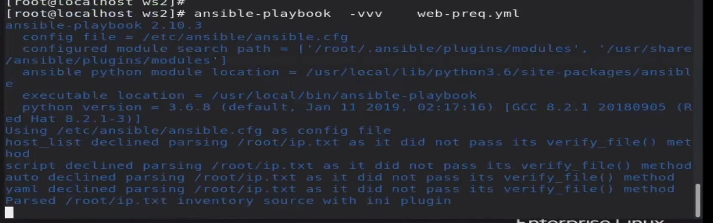

# ansible  all --list-host  ---> to list all host

# ansible all -m -a service "name=httpd state=started"  ------> to run the following service

# ansible all -m ping 

# ansible all -m service -a "name=httpd state=started"  ------> to start httpd service in node vm {BUT TO HOW TO MAKE IT ENABLE}

# ansible all -m package -a "name=httpd state=present" -----> to install any package in managed node

# ansible all -m copy -a "src=/root/rizwan.html dest=/var/www/html/" ------> To copy files from CN to MN

# ansible-playbook -i ip.txt -vvv rizwan.yml --> to see more details keep adding v for 1 ,2 ,3

# 